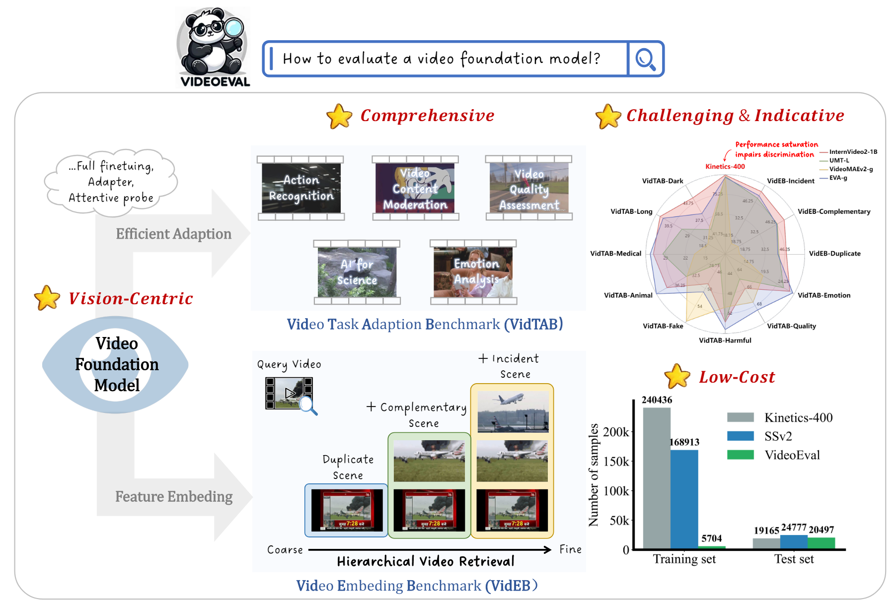

# VideoEval: Comprehensive Benchmark Suite for Low-Cost Evaluation of Video Foundation Model





## :fire: Updates
- **2024/06/12**: Release annotations and evaluation codes of **VideoEval**, which includes VidTAB and VidEB.

## 🛠️ Requirements and Installation

For VidTAB, we base on  [MMAction2](https://github.com/open-mmlab/mmaction2) for training and evaluation:

```cmd
pip install -U openmim
mim install mmengine 'mmcv>=2.0.0rc1'
mim install "mmdet>=3.0.0rc5"
mim install "mmpose>=1.0.0rc0"
git clone https://github.com/leexinhao/VideoEval.git
cd VidTAB
pip install -v -e .
```

## :bar_chart: Benchmark

### Data Preparation

Due to potential copyright issues, please refer to [DATA.md](https://github.com/leexinhao/VideoEval/tree/main/VidTAB/DATA.md) to download the original videos of each dataset separately, and we will share our version of the dataset after we confirm that there are no copyright issues. 

For VidTAB, you could directly use the [annotations](https://github.com/leexinhao/VideoEval/tree/main/VidTAB/annotations) we prepared.

### Video Task Adaptation Benchmark (VidTAB)

#### Few-Shot Evaluation

For training and evaluation, you could refer to [here](https://mmaction2.readthedocs.io/en/latest/user_guides/train_test.html), and we provide [configs](https://github.com/leexinhao/VideoEval/tree/main/VidTAB/configs) of diffenent VFMs for your reference.

In brief, you can use `tools/train.py` to train a model on a single machine with **a CPU and optionally a GPU** (Our experiment also uses only one GPU).

```bash
python tools/train.py ${CONFIG_FILE} [ARGS]
```

And I provide my train scripts `tools/my_train.sh` for avoiding setting [ARGS], then you could begin to use VidTAB by execute a bash file like this:

```bash
bash tools/my_train.sh configs/video_eval/AR_in_Dark/Internvideo2/frozen_tuning/InternVideo2-1B-stage1-pt_16_shot_bs16.py
bash tools/my_train.sh configs/video_eval/AR_in_Dark/Internvideo2/frozen_tuning/InternVideo2-1B-stage1_100_shot_bs16.py
bash tools/my_train.sh configs/video_eval/AR_in_Dark/Internvideo2/frozen_tuning/InternVideo2-1B-stage1-pt_100_shot_bs16.py
...
bash tools/my_train.sh configs/video_eval/Fake_face/ViCLIP/frozen_tuning/ViCLIP-200M_16_shot_bs16.py
bash tools/my_train.sh configs/video_eval/Fake_face/ViCLIP/frozen_tuning/ViCLIP-10M_100_shot_bs16.py
bash tools/my_train.sh configs/video_eval/Fake_face/ViCLIP/frozen_tuning/ViCLIP-10M_16_shot_bs16.py
bash tools/my_train.sh configs/video_eval/Fake_face/ViCLIP/frozen_tuning/ViCLIP-200M_100_shot_bs16.py
bash tools/my_train.sh configs/video_eval/Fake_face/ZeroI2V/linear_adapter0d125/ZeroI2V-CLIP-L_100_shot_bs16.py
```

Then you can go to the work dir to find the corresponding log file to see the result, In all our experiments, we conducted validation during the training process to select the epoch with the highest accuracy. Consequently, there was no need for additional performance testing after the training was completed. Furthermore, please note that we used **a single clip rather than three clips** to obtain the final performance metrics.

#### Zero-Shot Evaluation

**Prompts for  Zero-Shot Evaluation**: see [prompts for image backbones](https://github.com/leexinhao/VideoEval/blob/main/VidTAB_Zeroshot/img_prompt_gen.py), [prompts for video backbones](https://github.com/leexinhao/VideoEval/blob/main/VidTAB_Zeroshot/vid_prompt_gen.py).

```bash
bash exp/vid_zs.sh #for video backbones
bash exp/img_zs.sh #for image backbones
```

### Video Embed Benchmark (VidEB)

todo

## :page_facing_up: Citation

If you find this project useful in your research, please consider cite:
```BibTeX

```

